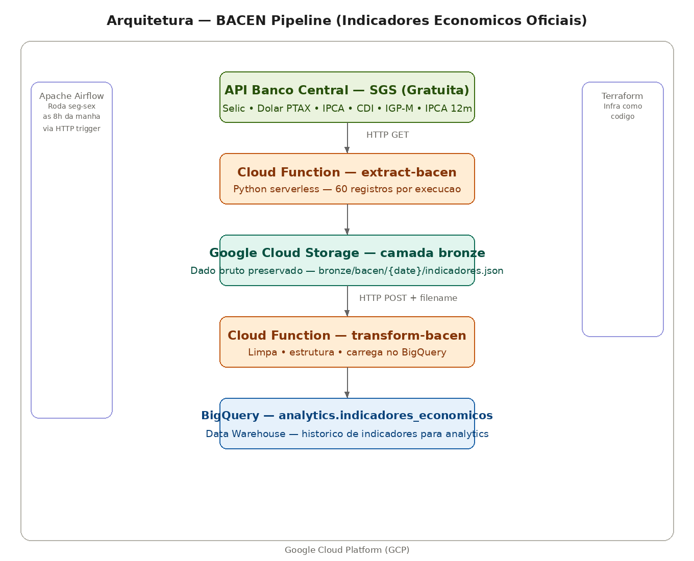

# BACEN Pipeline — Indicadores Econômicos Oficiais

Pipeline de dados que extrai indicadores econômicos oficiais do Banco Central do Brasil diariamente, usando Cloud Functions, Airflow e BigQuery — arquitetura idêntica à utilizada em times de engenharia de dados de fintechs.

## Arquitetura




**Ingestão:** Cloud Function Python consome a API SGS do Banco Central (gratuita, sem autenticação), extraindo os últimos 10 registros de 6 indicadores econômicos.

**Data Lake:** Dados brutos armazenados no GCS na camada bronze — JSON preservado para reprocessamento a qualquer momento.

**Transformação:** Segunda Cloud Function lê o arquivo do GCS, estrutura os dados e insere no BigQuery.

**Orquestração:** Airflow agenda o pipeline de segunda a sexta às 8h, passando o nome do arquivo entre as tasks via XCom.

**Infraestrutura:** Bucket GCS, dataset e tabela BigQuery provisionados via Terraform.

## Indicadores extraídos

| Indicador | Código SGS | Unidade |
|---|---|---|
| Selic | 11 | % a.a. |
| Dólar PTAX | 1 | R$ |
| IPCA | 433 | % a.m. |
| CDI | 12 | % a.a. |
| IGP-M | 189 | % a.m. |
| IPCA Acumulado 12m | 7326 | % |

## Tecnologias

| Tecnologia | Função |
|---|---|
| Python | Lógica das Cloud Functions |
| Google Cloud Functions | Execução serverless das ETLs |
| Google Cloud Storage | Data Lake — camada bronze |
| BigQuery | Data Warehouse — camada gold |
| Apache Airflow | Orquestração via HTTP |
| Terraform | Infraestrutura como código |

## Por que esse projeto é relevante para fintechs

O Banco Central publica diariamente os indicadores que movem o mercado financeiro. Selic e CDI definem o custo do dinheiro. O dólar PTAX é a referência oficial de câmbio usada em contratos financeiros. O IPCA define a inflação oficial. Qualquer fintech acompanha esses números todo dia — e ter um pipeline que os coleta, armazena e disponibiliza automaticamente é exatamente o tipo de solução que times de dados de fintechs constroem.

## Queries no BigQuery

```sql
-- Historico da Selic
SELECT data, valor, unidade
FROM `bacen-pipeline.analytics.indicadores_economicos`
WHERE indicador = 'Selic'
ORDER BY data DESC;

-- Variacao do dolar na ultima semana
SELECT data, valor
FROM `bacen-pipeline.analytics.indicadores_economicos`
WHERE indicador = 'Dolar PTAX'
ORDER BY data DESC
LIMIT 7;

-- Todos os indicadores do dia mais recente
SELECT indicador, valor, unidade, data
FROM `bacen-pipeline.analytics.indicadores_economicos`
WHERE extraction_date = (SELECT MAX(extraction_date) FROM `bacen-pipeline.analytics.indicadores_economicos`)
ORDER BY indicador;
```

## Como rodar

### 1. Criar infraestrutura GCP
```bash
cd terraform
terraform init
terraform apply
```

### 2. Deploy das Cloud Functions
```bash
gcloud functions deploy extract-bacen \
  --gen2 --runtime=python311 --region=us-central1 \
  --source=functions/extract --entry-point=extract_bacen \
  --trigger-http --allow-unauthenticated --timeout=120s

gcloud functions deploy transform-bacen \
  --gen2 --runtime=python311 --region=us-central1 \
  --source=functions/transform --entry-point=transform_bacen \
  --trigger-http --allow-unauthenticated --timeout=120s
```

### 3. Subir o Airflow
```bash
cd docker
docker compose up airflow-init
docker compose up -d
```

### 4. Ativar a DAG
Acesse o Airflow em `http://localhost:8087` e ative a DAG `pipeline_bacen`.

## Autor

**Lucas Magalhães** — Engenheiro de Dados

[](https://github.com/lucasmagalhaess)
[](https://linkedin.com/in/lucasmagalhaes-data)
